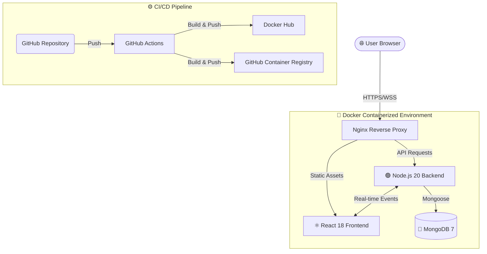

<div align="center">

# 🚀 TaskFlow (Nexus)

> **A production-grade full-stack task management platform with real-time collaboration, built with the MERN stack, Docker, and CI/CD.**

[](https://github.com/ragnarstark79/taskflow)
[](https://hub.docker.com/u/ragnarstark79)
[](https://github.com/ragnarstark79/taskflow/actions)
[](https://github.com/ragnarstark79/taskflow/graphs/commit-activity)

[Features](#-core-features) • [Tech Stack](#-tech-stack) • [Architecture](#-system-architecture) • [Quick Start](#-quick-start) • [Roadmap](#-roadmap)

---

### 🌟 Experience the Future of Productivity
TaskFlow combines power-user features with a breathtaking interface inspired by the best of Apple's design language.

</div>

---

## 🎨 UI/UX Philosophy: Glassmorphism & Neumorphism
TaskFlow is not just a tool; it's a visual statement. We've blended two of the most modern design trends to create a "Living UI".

- **✨ Glassmorphism**: High-fidelity translucent layers with `backdrop-filter: blur(20px)`, giving the app depth and a premium feel.
- **☁️ Neumorphism**: Soft, tactile interactive elements that feel organic and responsive to every click.
- **🎬 Fluid Motion**: Micro-interactions and page transitions powered by **Framer Motion** and **GSAP** for a 60fps experience.
- **🌗 Universal Dark Mode**: A sophisticated dark theme that's easy on the eyes, featuring custom-tuned slate and indigo palettes.

---

## 🚀 Core Features

| Feature | Description | Status |
| :--- | :--- | :--- |
| 🔄 **Real-time Sync** | Multi-user collaboration with **Socket.io**. Changes propagate instantly. | ✅ |
| 📋 **Smart Kanban** | Drag-and-drop board with column management powered by **dnd-kit**. | ✅ |
| 🛡️ **Enterprise Auth** | Secure JWT-based auth with auto-refresh tokens and HTTP-only cookies. | ✅ |
| 🏢 **Workspace RBAC** | Manage multiple teams with Role-Based Access Control (Admin/Member). | ✅ |
| 📊 **Insight Analytics** | Beautiful data visualization using **Recharts** on your personal dashboard. | ✅ |
| 📁 **Rich Attachments** | Drag & drop file uploads (Images, PDFs) directly into task cards. | ✅ |
| 🔔 **Smart Notifications** | In-app alerts for assignments, deadlines, and team comments. | ✅ |

---

## 🏗 System Architecture



---

## 🛠 Tech Stack

### Frontend & UI


### Backend & Real-time


### DevOps & Deployment


---

## ⚡ Quick Start

### 1. Clone & Prep
```bash
git clone https://github.com/ragnarstark79/taskflow.git
cd taskflow
cp .env.example .env
```

### 2. Ignition
```bash
# Launch the entire stack in production mode
docker compose up --build
```
> The application will be live at **http://localhost**.

---

## 🛠 Development Workflow
For contributors who need hot-reloading and development tools:

```bash
docker compose -f docker-compose.dev.yml up --build
```
- **Frontend**: http://localhost:3000
- **Backend API**: http://localhost:5001
- **Real-time Gateway**: ws://localhost:5001

---

## 📂 Project Structure
```text
├── frontend/         # React 18 + Tailwind 4 + Framer Motion
├── backend/          # Express API + Socket.io + Mongoose
├── nginx/            # Reverse proxy & static serving config
├── .github/          # Automated CI/CD workflows (GHA)
├── docker-compose.yml# Production stack orchestration
└── .env.example      # Template for environment variables
```

---

## 🗺 Roadmap
- [x] **Phase 1**: Core Kanban & JWT Auth
- [x] **Phase 2**: Real-time collaboration & Workspaces
- [x] **Phase 3**: Analytics Dashboard & Dark Mode
- [ ] **Phase 4**: OAuth2 (Google/GitHub) Integration
- [ ] **Phase 5**: Mobile App (React Native)
- [ ] **Phase 6**: AI Task Prioritization

---

<div align="center">

### Built by **Ragnar Stark**
**Roll No. 34** · **Reg No. 12314129** · **INT332 (S30M59)**

[](https://linkedin.com/in/ragnarstark)
[](https://github.com/ragnarstark79)

---
© 2024 TaskFlow Project. All rights reserved.
</div>
